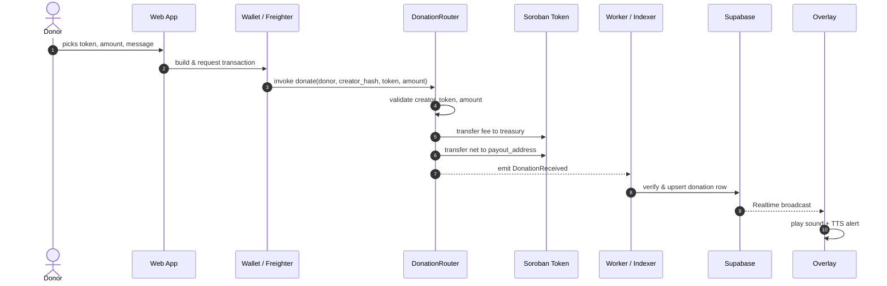

# DonationRouter

A Soroban smart contract written in Rust for StarTip. `DonationRouter` handles:

- Creator registration and payout address storage.
- Token allowlist management.
- Receiving donations, splitting the platform fee, and transferring the net amount directly to the creator.
- Emitting events that the indexer and web app consume to stay in sync.

## How it works

### 1. Initialization

The contract uses the CAP-0058 constructor (`__constructor`), which runs once at deployment. It accepts:

- `admin`: the administrator address.
- `treasury_address`: the address that receives platform fees.
- `platform_fee_bps`: the current platform fee in basis points (1% = 100).
- `max_fee_bps`: the immutable maximum fee cap for the lifetime of the contract (currently 5% = 500).

If `platform_fee_bps > max_fee_bps`, the contract reverts with `FeeCapExceeded`.

### 2. Storage

The contract uses two Soroban storage types:

- **Instance storage** - holds the singleton `Config`:

  - `admin`
  - `treasury_address`
  - `platform_fee_bps`
  - `max_fee_bps`
  - `paused`
  - `token_allowlist`

- **Persistent storage** - holds one `Creator` entry per creator, keyed by `sha256(handle)`:
  - `owner`: the address that owns the creator entry.
  - `payout_address`: the address that receives donations.
  - `active`: whether the creator is currently accepting donations.

Both storage types are bumped on every interaction (default ~518,400 ledgers, approximately 30 days at 5 seconds per ledger).

### 3. Registration and creator management

- `register_creator(owner, creator_id_hash, payout_address)`

  - `owner` must authenticate with `require_auth`.
  - `creator_id_hash` is `sha256(handle)`.
  - Reverts with `AlreadyRegistered` if the hash already exists.
  - Stores the creator with `active = true` and emits `CreatorRegistered`.

- `update_creator_payout(caller, creator_id_hash, new_payout_address)`

  - Only the creator `owner` can call.
  - Updates `payout_address` and emits `CreatorPayoutUpdated`.

- `set_creator_active_owner(caller, creator_id_hash, active)`

  - Allows the owner to pause or resume their own creator entry.

- `force_pause_creator(caller, creator_id_hash, active)`
  - Allows the admin to pause or resume any creator entry (for example, in case of abuse).

### 4. Token allowlist management

Only the admin can add or remove tokens:

- `add_token(admin, token)`
- `remove_token(admin, token)`

Each token must be a valid Soroban token contract address. Every allowlist change emits `TokenAllowlistUpdated`.

### 5. Donation flow (`donate`)

`donate(donor, creator_id_hash, token, amount)` is the core flow. The contract validates the request in this order:

1. `donor.require_auth()` - authenticate the donor.
2. The contract is not paused (`Paused`).
3. The creator exists (`CreatorNotFound`).
4. The creator is active (`CreatorInactive`).
5. `amount > 0` (`InvalidAmount`).
6. The token is in the `token_allowlist` (`TokenNotAllowed`).

The donation is split as follows:

```
fee_amount = amount * platform_fee_bps / 10_000
net_amount = amount - fee_amount
```

- `fee_amount` is transferred to `treasury_address`.
- `net_amount` is transferred to `creator.payout_address`.
- Zero transfers are skipped.

`donate` uses `soroban_sdk::token::Client::transfer` with `from` set to `donor`. Because Soroban propagates authorization through nested calls, the donor only needs to sign a single transaction.

After the transfers succeed, the contract emits `DonationReceived` with:

- `creator_id_hash`
- `token`
- `amount` (gross)
- `fee_amount`
- `net_amount`
- `treasury_address`
- `payout_address`

The indexer/worker listens for this event to confirm the donation and upsert it into Supabase.



### 6. Platform fee

`platform_fee_bps` can be updated by the admin via `set_platform_fee_bps`, but it can never exceed `max_fee_bps` (5%). The current testnet deployment is:

- `platform_fee_bps = 100` (1%)
- `max_fee_bps = 500` (5%)

### 7. Other admin operations

- `set_treasury_address(admin, new_treasury)` - change the fee recipient.
- `set_paused(admin, paused)` - pause or resume the entire contract.
- `set_admin(admin, new_admin)` - transfer admin rights in a single step (no propose/accept flow).

## Public functions

| Function                   | Description                 | Caller        |
| -------------------------- | --------------------------- | ------------- |
| `__constructor`            | Initialize the contract     | Deployer      |
| `get_config`               | Read the `Config`           | Anyone        |
| `get_creator`              | Read a `Creator` by hash    | Anyone        |
| `register_creator`         | Register a creator          | Owner (signs) |
| `update_creator_payout`    | Update payout address       | Owner         |
| `set_creator_active_owner` | Pause/resume creator        | Owner         |
| `force_pause_creator`      | Pause/resume creator        | Admin         |
| `set_treasury_address`     | Change treasury address     | Admin         |
| `set_platform_fee_bps`     | Change platform fee         | Admin         |
| `set_paused`               | Pause/unpause contract      | Admin         |
| `set_admin`                | Transfer admin rights       | Admin         |
| `add_token`                | Add token to allowlist      | Admin         |
| `remove_token`             | Remove token from allowlist | Admin         |
| `donate`                   | Execute a donation          | Donor (signs) |

## Events

| Event                   | When emitted                                    |
| ----------------------- | ----------------------------------------------- |
| `CreatorRegistered`     | `register_creator` succeeds                     |
| `CreatorPayoutUpdated`  | `update_creator_payout` succeeds                |
| `CreatorActiveChanged`  | Creator is paused or resumed                    |
| `TreasuryUpdated`       | `set_treasury_address` succeeds                 |
| `PlatformFeeUpdated`    | `set_platform_fee_bps` succeeds                 |
| `PausedChanged`         | `set_paused` succeeds                           |
| `AdminUpdated`          | `set_admin` succeeds                            |
| `TokenAllowlistUpdated` | Token is added to or removed from the allowlist |
| `DonationReceived`      | `donate` succeeds                               |

## Error codes

| Code | Name                | Meaning                       |
| ---- | ------------------- | ----------------------------- |
| 1    | `Unauthorized`      | Caller is not authorized      |
| 2    | `Paused`            | Contract is paused            |
| 3    | `CreatorNotFound`   | Creator does not exist        |
| 4    | `CreatorInactive`   | Creator is paused             |
| 5    | `InvalidAmount`     | Amount is not valid (<= 0)    |
| 6    | `TokenNotAllowed`   | Token is not in the allowlist |
| 7    | `FeeCapExceeded`    | Fee exceeds the maximum cap   |
| 8    | `AlreadyRegistered` | Creator is already registered |

## Build and test

From the monorepo root:

```bash
# Build WASM
pnpm contracts:build

# Run unit tests
pnpm contracts:test

# Run integration tests (requires Docker)
pnpm contracts:integration
```

Or run directly inside this directory:

```bash
cargo build --target wasm32v1-none --release
cargo test
```

## Links

- Back to the [main README](../README.md)
- Contract source code: [src/lib.rs](./src/lib.rs)
